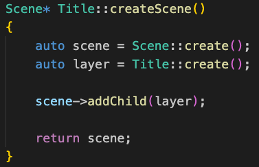
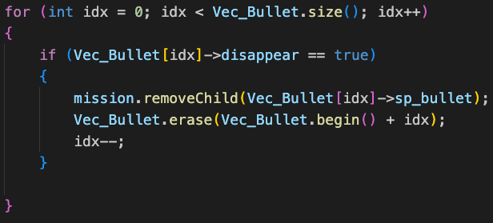
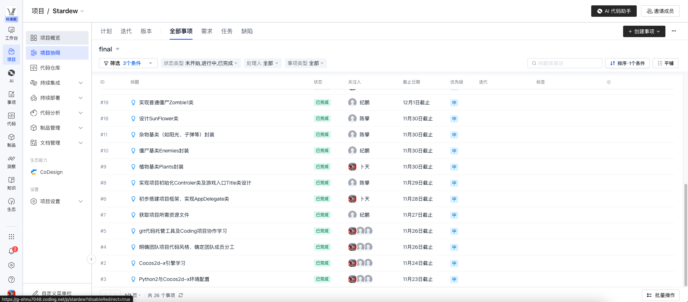
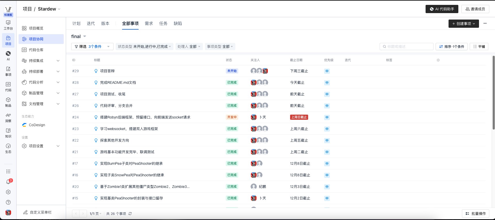

# Plants vs Zombies With Cocos2d-x 加分项

#### 1. 尽可能多地使用C++11新特性

* auto类型推断

  
 
* 空指针nullptr

  
 
* STL容器（eg. vector）

  
 
* 智能指针

  
 
* 类和多态
  
  

#### 2. 具有11套不同的关卡和背景

  
  
  
  
  
  
  
  
  
  
  

#### 3. 支持高帧率、具有完善的音效和动画效果
  * 详见demo
  
#### 4. 项目分工明确、需求池完备、分支安排得当，具备企业项目开发特征
  
  
  
  