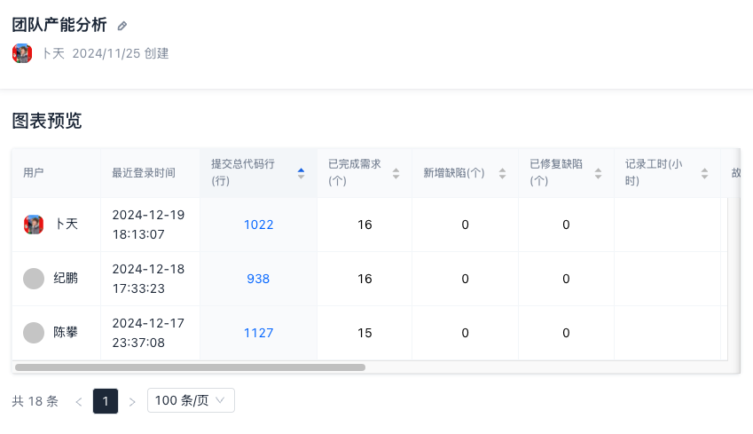
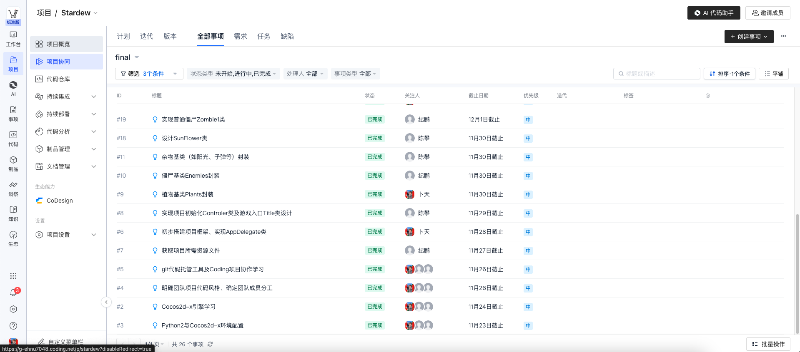
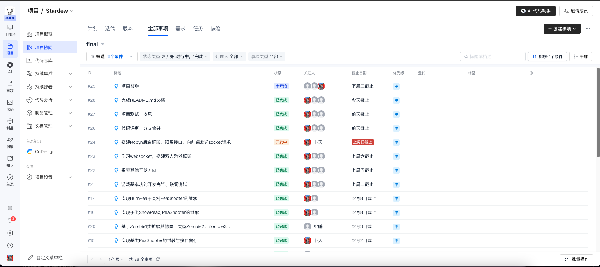
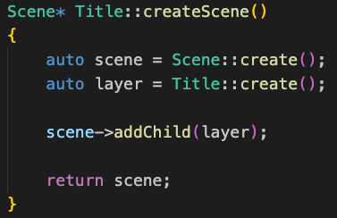
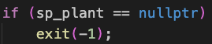
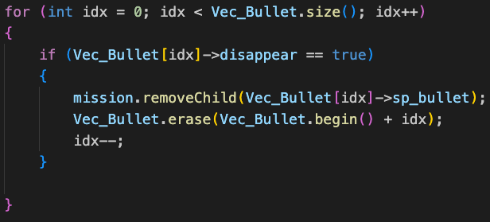
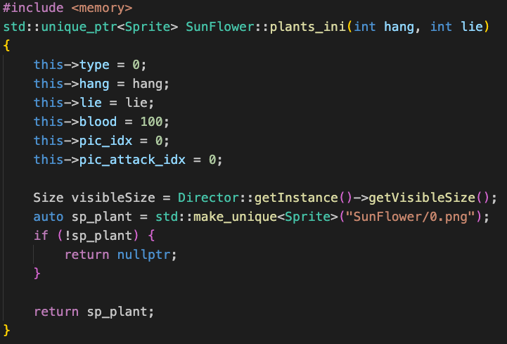
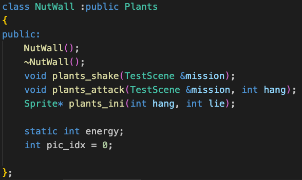

# Plants vs Zombies With Cocos2d-x

> TIP:
> 抵制不良游戏 拒绝盗版游戏 注意自我保护 谨防受骗上当
>
> 适度游戏益脑 沉迷游戏伤身 合理安排时间 享受健康生活

## 项目名称

Plants vs Zombies With Cocos2d-x

## 项目简介

A project of Plants vs Zombies based on [Cocos2d-x 3.17.2](https://docs.cocos.com/cocos2d-x/manual).

基于 [Cocos2d-x 3.17.2](https://docs.cocos.com/cocos2d-x/manual) 开发的植物大战僵尸项目。

> ***Relevant course***
> Programing Paradigm 2024, Tongji University (2024年同济大学程序设计范式)

This project is a Plants vs. Zombies game developed using Cocos2d-x, inspired by games like *Plants vs. Zombies* and *Plants vs. Zombies (Hybrid Edition)*. The game includes a variety of traditional features, such as the classic initial and settings interface, background sound effects, a diverse range of plant and zombie cards, and multiple map backgrounds. The team replicated the game logic of the original *Plants vs. Zombies* and further explored a new multiplayer cooperative mode by leveraging Robyn and WebSocket, offering players a richer and more immersive gaming experience.

该项目是一个基于Cocos2d-x开发的植物大战僵尸，灵感来自于《植物大战僵尸》《植物大战僵尸（杂交版）》等游戏。游戏拥有丰富的传统功能，如传统植物大战僵尸的初始和设置界面、背景音效、多种植物与僵尸卡牌、多种地图背景。团队复现了植物大战僵尸的游戏逻辑，并在此基础上探索通过Robyn+websocket实现多人合作游戏的全新模式，为玩家带来更加丰富和沉浸式的游戏体验。

## 项目资源

本项目全部资源，包括植物、僵尸图片、地图图片、字体文件、音效文件以及UI制作过程中其他涉及到的资源文件均来自Gitcode中开源工具包 [植物大战僵尸完整素材包(原版) README](https://gitcode.com/open-source-toolkit/85737/overview?utm_source=tools_gitcode&index=top&type=href&)。谨在此对素材包作者及贡献者表达感谢。

## 成员分工

| 姓名 | 学号 | 分工 |
| :---: | :---: | :---: |
| 卜天 | 2350939 | 初步搭建项目框架、实现`AppDelegate`类 植物基类`Plants`封装 实现基类`PeaShooter`的封装与接口留存 实现子类`SnowPea`对`PeaShooter`的继承 实现`BurnPea`子类对`PeaShooter`的继承 联调测试 搭建Robyn后端框架，预留接口，向前端发送socket请求 |
| 陈攀 | 2353243 | 实现项目初始化`Controler`类及游戏入口`Title`类设计 设计`SunFlower`类 实现`NutWall`类与交互细节 杂物基类（如阳光、子弹等）封装 实现`CherryBomb`类与交互细节 联调测试 |
| 纪鹏 | 2351869 | 获取项目所需资源文件 僵尸基类`Enemies`封装 实现普通僵尸`Zombie1`类 基于`Zombie1`类扩展其他僵尸类型`Zombie2`、`Zombie3`... 实现子类`SnowPea`对`PeaShooter`的继承 实现`BurnPea`子类对`PeaShooter`的继承 联调测试 |

## 成员贡献

| 姓名 | 学号 | 代码行数 | 工作量 |
| :---: | :---: | :---: | :---: |
| 卜天 | 2350939 | 1022 | 33% |
| 纪鹏 | 2351869 | 938 | 33% |
| 陈攀 | 2353243 | 1127 | 33% |

## 项目组成

* `/src`
项目源代码

  * `/Classes`
  类定义与类实现

  * `/Resources`
  资源文件

* `PvZ.exe`
项目可执行文件

* `README.md`
项目文档

* `Presentation.pptx`
项目答辩汇报

## 项目开发日志

### 2024/11/23

* Python 2.7 环境配置（卜天、陈攀、纪鹏）
* Cocos2d-x 环境配置（卜天、陈攀、纪鹏）

### 2024/11/24

* Cocos2d-x引擎学习（卜天、陈攀、纪鹏）
  
### 2024/11/26

* 明确团队项目代码规范，确定团队成员分工（卜天、陈攀、纪鹏）
* git代码托管工具及Coding项目协作学习（卜天、陈攀、纪鹏）

### 2024/11/27

* 获取项目所需资源文件（纪鹏）

### 2024/11/28

* 初步搭建项目框架、实现`AppDelegate`类（卜天）

### 2024/11/29

* 实现项目初始化`Controler`类及游戏入口`Title`类设计（陈攀）

### 2024/11/30

* 设计`SunFlower`类（陈攀）
* 杂物基类（如阳光、子弹等）封装（陈攀）
* 僵尸基类`Enemies`封装（纪鹏）
* 植物基类`Plants`封装（卜天）

### 2024/12/1

* 实现普通僵尸`Zombie1`类（纪鹏）

### 2024/12/2

* 实现`CherryBomb`类与交互细节（陈攀）
* 实现`NutWall`类与交互细节（陈攀）
* 实现基类`PeaShooter`的封装与接口留存（卜天）

### 2024/12/3

* 基于`Zombie1`类扩展其他僵尸类型`Zombie2`、`Zombie3`...（纪鹏）

### 2024/12/8

* 实现子类`SnowPea`对`PeaShooter`的继承（卜天、纪鹏）
* 实现`BurnPea`子类对`PeaShooter`的继承（卜天、纪鹏）

### 2024/12/10

* 游戏基本功能开发完毕、联调测试（卜天、陈攀、纪鹏）

### 2024/12/13

* 探索其他开发方向（卜天、陈攀、纪鹏）

### 2024/12/14

* 学习websocket，搭建双人游戏框架（卜天、陈攀、纪鹏）

### 2024/12/15

* 搭建Robyn后端框架，预留接口，向前端发送socket请求（卜天）

### 2024/12/17

* 代码评审、分支合并（卜天、陈攀、纪鹏）
* 项目测试、收尾（卜天、陈攀、纪鹏）

### 2024/12/19

* 完善项目自述文档 `README.md`（卜天、陈攀、纪鹏）

### 2024/12/25

* 答辩验收（卜天、陈攀、纪鹏）

 

## 集成开发环境与编译运行环境

* Microsoft Visual Studio 2022
* 本项目适用于x86架构

## 项目中C++11新特性
* auto类型推断

  
 
* 空指针nullptr

  
 
* STL容器（eg. vector）

  
 
* 智能指针

  
 
* 类和多态
  
  

## 免责声明

The code and materials contained in this repository are intended for personal learning and research purposes only and may not be used for any commercial purposes.We are not responsible for any direct or indirect consequences arising from the improper use of the contents of this repository. Please ensure that your actions comply with the relevant regulations, as well as applicable laws and regulations, before using this content. If you have any questions, please contact me via [email](mailto:15947513567@163.com).

本仓库包含的代码和资料仅用于个人学习和研究目的，不得用于任何商业用途。本人对因不恰当使用仓库内容导致的任何直接或间接后果不承担责任。请在使用前务必确保您的行为符合相关规定，以及适用的法律法规。如有任何问题，请通过[电子邮件](mailto:15947513567@163.com)与我联系。

* ## 文档更新日期

2024年12月19日